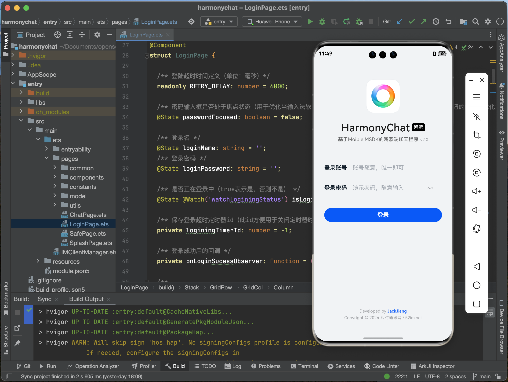
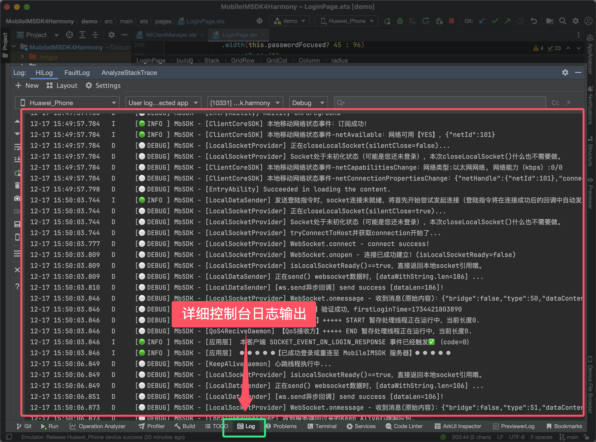

# 一、HarmonyChat是什么？

HarmonyChat是 **一个简洁的鸿蒙NEXT上的基于WebSocket协议的聊天客户端** ，它基于[MobileIMSDK](https://gitee.com/jackjiang/MobileIMSDK)通信库， **有完善的网络通信通力、简洁的聊天界面UI、合理的代码拆分和逻辑实现，非常适合学习研究或直接用于简单的鸿蒙NEXT单页聊天项目中** 。

# 二、为什么有HarmonyChat？

我本身是[MobileIMSDK](https://gitee.com/jackjiang/MobileIMSDK)开源框架的作者，正好近期趁着开发MobileIMSDK的鸿蒙NEXT端演示界面的机会，把相关的UI代码整理出来，希望在当前鸿蒙有质量的资料比较少的情况下，能带给需要的人一点启发或帮助。

你如果在HarmonyChat中看到有关MobileIMSDK的资料和字眼也不要奇怪，因为本工程中的代码、资料、想法，都是从[MobileIMSDK的鸿蒙NEXT端工程](https://gitee.com/jackjiang/MobileIMSDK/tree/master/demo_src/WebSocket)中整理和抽取出来的，目的是方便需要的人从单独的UI界面和功能来学习和使用。

# 三、谁需要HarmonyChat？

目前高质量的鸿蒙NEXT端IM聊天方面的开源代码还非常少（几乎找不到有价值的开源分享），所以我希望能把自已编写的相关代码抽取出来供需要的人借鉴和使用，共同进步。

<b>HarmonyChat特别适合以下开发者学习、研究或直接使用</b>：

1. :triangular_flag_on_post: 想学习使用ArkTS和ArkUI开发聊天界面的；
2. :triangular_flag_on_post: 想学习如果在鸿蒙NEXT中对接网络通信代码的；
3. :triangular_flag_on_post: 想学习IM聊天程序如何在鸿蒙NEXT中实现UI和网络数据的逻辑分离的；
4. :triangular_flag_on_post: 想得到可以直接使用的单页聊天界面的；
5. :triangular_flag_on_post: 想要开发IM聊天应用，但需要一个脚手架作为起点的。

# 四、实现了哪些特性？

1. :triangular_flag_on_post: 实现了一个UI简洁、代码清晰、逻辑分层合理的聊天界面（可以直接复制到一些单页聊天产中品用，比如客服聊天）；
2. :triangular_flag_on_post: 消息的送达状态在UI界面上会自动更新显示（包括发送中、已送达、送达失败）；
3. :triangular_flag_on_post: 网络连接状态的UI显示（含心跳呼吸灯效果）；
4. :triangular_flag_on_post: 实现了真正的网络通信和聊天（包括完整的多端互踢、网络心跳、掉线重连、消息重传、消息应答、消息去重等），这是基于MobileIMSDK通信库实现的；
5. :triangular_flag_on_post: 实现了隐私提醒、闪屏、登录界面的判断和跳转逻辑（可以直接复制这几个界面到你的产品中去用用）
6. :triangular_flag_on_post: 鸿蒙NEXT的List列表在LazyForEach带来的性能优化情况下的动态UI刷新；
7. :triangular_flag_on_post: 利用DataSource和一个全局消息缓存管理机制实现网络数据与UI的解偶（<b>这是IM消息和UI解偶的关键</b>）；
8. :triangular_flag_on_post: 实现了跟微信基本一致的消息时间计算和显示逻辑（人性化时间、超过2分钟才显示时间）；
9. :triangular_flag_on_post: 合理的拆分了不同消息类型组件式扩展的实现逻辑，方便扩展更多消息类型的UI显示；
10. :triangular_flag_on_post: 解决了消息文本超长导致Row()组件被挤出屏幕可视区显示的问题（这可能是鸿蒙的bug）；
11. :triangular_flag_on_post: 一些鸿蒙NEXT简单动画的应用；
12. :triangular_flag_on_post: 适配全面屏；
13. :triangular_flag_on_post: 详细的代码注释，便于学习研究。

# 五、源码的开源仓库地址

 **HarmonyChat源码仓库：**

* 1）Gitee码云：[https://gitee.com/jackjiang/harmonychat](https://gitee.com/jackjiang/harmonychat) （速度快，首选 :point_left:）
* 2）Gitcode：[https://gitcode.com/hellojackjiang2011/harmonychat](https://gitcode.com/hellojackjiang2011/harmonychat)
* 3）Github：[https://github.com/JackJiang2011/harmonychat](https://github.com/JackJiang2011/harmonychat) 

 **开源MobileIMSDK的源码仓库：**

* 1）Gitee码云：[https://gitee.com/jackjiang/MobileIMSDK](https://gitee.com/jackjiang/MobileIMSDK)
* 2）Gitcode：[https://gitcode.com/hellojackjiang2011/MobileIMSDK](https://gitcode.com/hellojackjiang2011/MobileIMSDK)
* 3）Github：[https://github.com/JackJiang2011/MobileIMSDK](https://github.com/JackJiang2011/MobileIMSDK))

# 六、实际运行截图

#### 1）Demo 的登陆界面运行截图（点击可看大图 ▼）：

#### 2）Demo 的主界面运行截图（点击可看大图 ▼）：

#### 3）Demo 运行的同时，可以查看详细的 log 输出（方便调试）：

# 七、更多详细的技术要点

更详细的技术要点说明请参见我的博文《[开源IM聊天程序HarmonyChat：基于鸿蒙NEXT的WebSocket协议](http://www.52im.net/thread-4770-1-1.html)》，涉及了服务端的部署和运行、消息文本超长导致Row()组件被挤出屏幕可视区的问题、仿微信消息时间显示的代码实现、网络数据与UI界面解偶的实现、网络通信等。

# 八、相关资料

* ① [鸿蒙Next官方开发资料](https://developer.huawei.com/consumer/cn/doc/harmonyos-references-V5/js-apis-websocket-V5)
* ② [MobileIMSDK-鸿蒙Next端开发手册](http://www.52im.net/thread-4767-1-1.html)（* 推荐）
* ③ [MobileIMSDK-服务端部署手册](http://www.52im.net/thread-1272-1-1.html)

# 九、Bug上报和技术讨论

* 讨论学习和资料查阅：[点此进入](http://www.52im.net/)；
* bug和建议请发送至：`jb2011@163.com`，或者在本工程中开Issue也行；
* 作者博客：[关于作者](http://www.52im.net/thread-2792-1-1.html)）。
