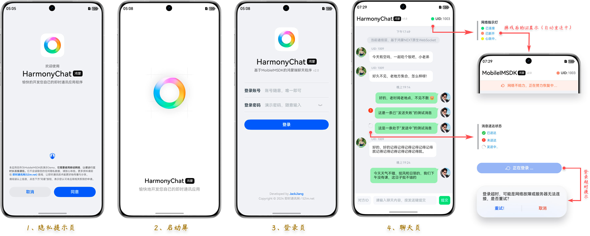
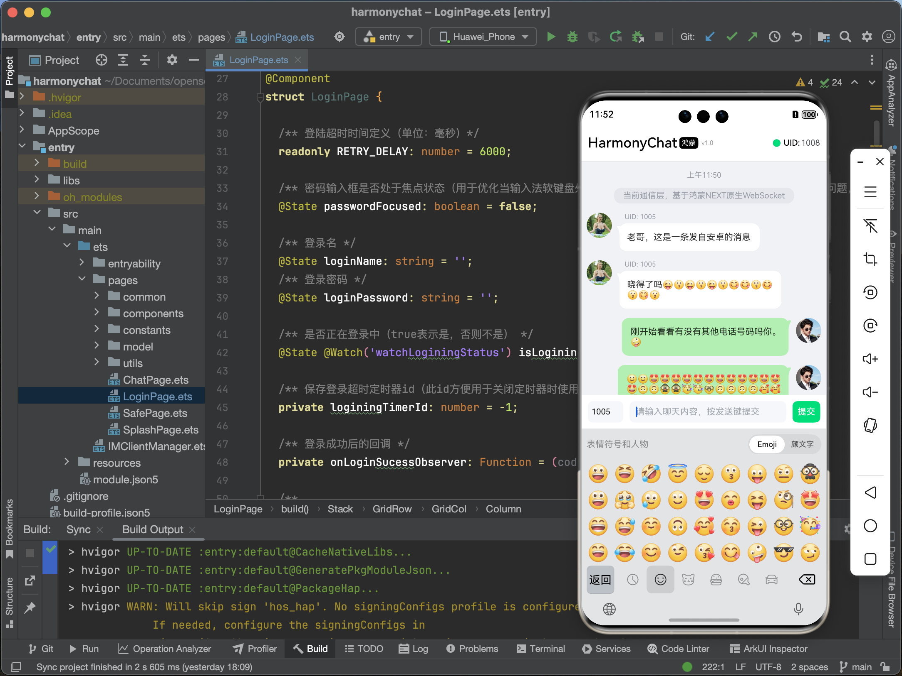
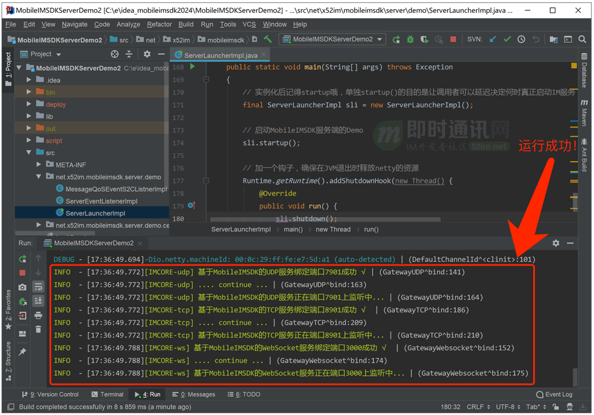
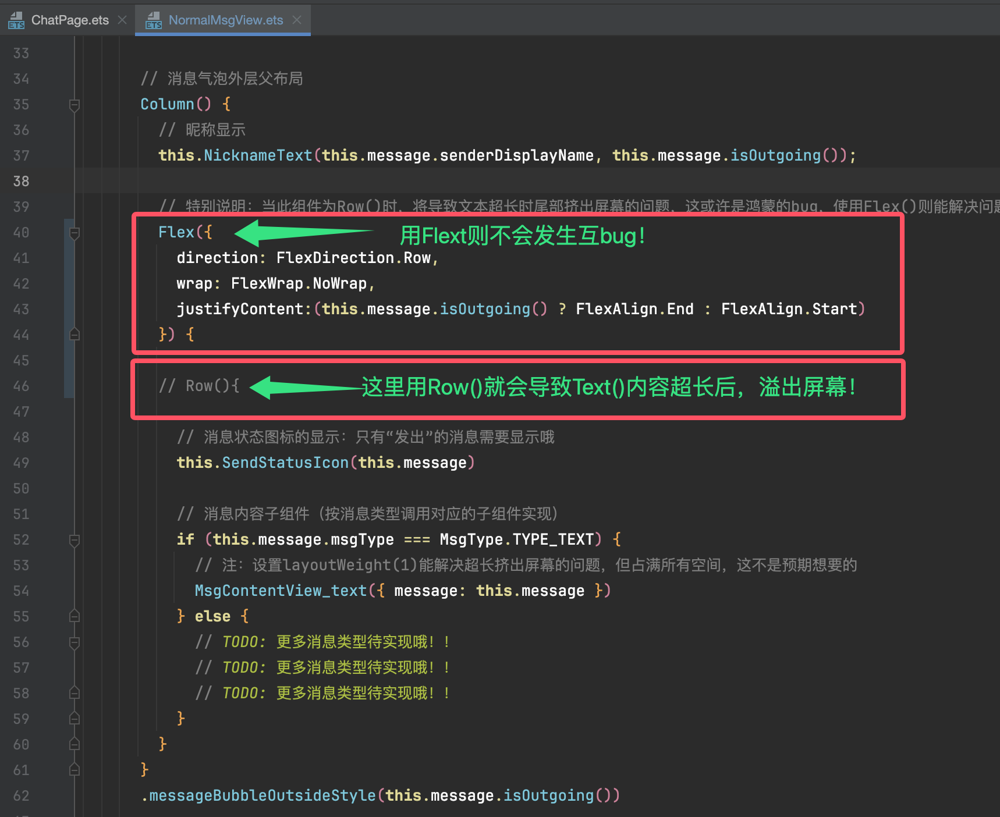
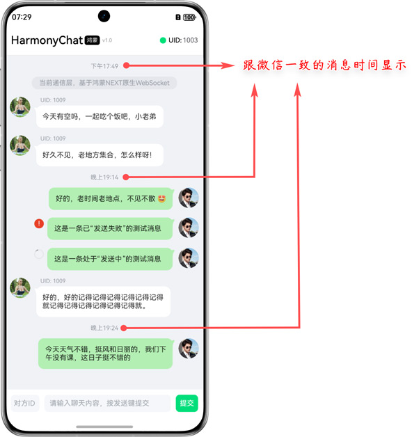

# 一、一句话总结本工程？

本工程分享的是 **一个简洁的鸿蒙NEXT上的基于WebSocket协议聊天客户端** ，它基于[MobileIMSDK](https://gitee.com/jackjiang/MobileIMSDK)通信库， **有完善的网络通信通力、简洁的聊天界面UI、合理的代码拆分和逻辑实现，非常适合学习研究或直接用于简单的聊天单面项目中** 。

# 二、为什么有此工程？

我本身是[MobileIMSDK](https://gitee.com/jackjiang/MobileIMSDK)开源框架的作者，正好近期趁着开发MobileIMSDK的鸿蒙NEXT端演示界面的机会，把相关的UI代码整理出来，希望在当前鸿蒙有质量的资料比较少的情况下，能带给需要的人一点启发或帮助。

你如果在本工程中看到有关MobileIMSDK的资料和字眼也不要奇怪，因为本工程中的代码、资料、想法，都是从[MobileIMSDK的鸿蒙NEXT端工程](https://gitee.com/jackjiang/MobileIMSDK/tree/master/demo_src/WebSocket)中整理和抽取出来的，目的是方便需要的以单独的UI界面和角度来学习和使用聊天界面这一块儿的代码。


# 三、谁需要？

目前高质量的鸿蒙NEXT端IM聊天方面的开源代码还非常少（几乎找不到有价值的开源分享），希望能把自已编写的这方面的聊天UI相关的代码抽取出来供需要的人借鉴和使用，共同进步。

<b>本工程特别适合以下开发者学习、研究或直接使用</b>：

1. :triangular_flag_on_post: 想学习使用ArkTS和ArkUI开发聊天界面的；
2. :triangular_flag_on_post: 想学习如果在鸿蒙NEXT中对接网络通信代码的；
3. :triangular_flag_on_post: 想学习IM聊天程序如何在鸿蒙NEXT中实现UI和网络数据的逻辑分离的；
4. :triangular_flag_on_post: 想得到可以直接使用的单页聊天界面的；
5. :triangular_flag_on_post: 想要开发IM聊天应用，但需要一个脚手架作为起点的。

# 四、实现了哪些特性？

1. :triangular_flag_on_post: 实现了一个UI简洁、代码清晰、逻辑分层合理的聊天界面（可以直接复制到一些单页聊天产中品用，比如客服聊天）；
2. :triangular_flag_on_post: 消息的送达状态在UI界面上会自动更新显示（包括发送中、已送达、送达失败）；
3. :triangular_flag_on_post: 网络连接状态的UI显示（含心跳呼吸灯效果）；
4. :triangular_flag_on_post: 实现了真正的网络通信和聊天（包括完整的多端互踢、网络心跳、掉线重连、消息重传、消息应答、消息去重等），这是基于MobileIMSDK通信库实现的；
5. :triangular_flag_on_post: 实现了隐私提醒、闪屏、登录界面的判断和跳转逻辑（可以直接复制这几个界面到你的产品中去用用）
6. :triangular_flag_on_post: 鸿蒙NEXT的List列表在LazyForEach带来的性能优化情况下的动态UI刷新；
7. :triangular_flag_on_post: 利用DataSource和一个全局消息缓存管理机制实现网络数据与UI的解偶（<b>这是IM消息和UI解偶的关键</b>）；
8. :triangular_flag_on_post: 实现了跟微信基本一致的消息时间计算和显示逻辑（人性化时间、超过2分钟才显示时间）；
9. :triangular_flag_on_post: 合理的拆分了不同消息类型组件式扩展的实现逻辑，方便扩展更多消息类型的UI显示；
10. :triangular_flag_on_post: 解决了消息文本超长导致Row()组件被挤出屏幕可视区显示的问题（这可能是鸿蒙的bug）；
11. :triangular_flag_on_post: 一些鸿蒙NEXT简单动画的应用；
12. :triangular_flag_on_post: 适配全面屏；
13. :triangular_flag_on_post: 详细的代码注释，便于学习研究。

# 五、运行效果说明图



# 六、实际运行截图

#### 1）Demo 的登陆界面运行截图（点击可看大图 ▼）：


#### 2）Demo 的主界面运行截图（点击可看大图 ▼）：


#### 3）Demo 运行的同时，可以查看详细的 log 输出（方便调试）：


# 七、实际运行视频动图

待补充。。。

# 九、技术要点1：关于服务端的部署和运行

本工程中默认连接的是MobileIMSDK开源工程的测试服务端，因条件有限，建议你自已部署服务端。资料请参考：《[MobileIMSDK开源服务端的部署指南](http://www.52im.net/thread-1272-1-1.html)》。

 **你也可以直接拉取MobileIMSDK开源服务端的源码自行编译和运行，就像下面这样：** 


  **PS：** MobileIMSDK开源服务端的源码可以在这个目录下找到：[点此查看](https://gitee.com/jackjiang/MobileIMSDK/tree/master/demo_src/Server/MobileIMSDKServerDemo2) :paperclip:，也可以直接用编译好的程序双击run.bat就可以运行（[点此查看](https://gitee.com/jackjiang/MobileIMSDK/tree/master/demo_binary/Server/MobileIMSDKServerDemo_deploy_v6.5b240429) :paperclip:。

 **如上图所示：** 本工程中因为用到的是鸿蒙Next的WebSocket协议，所以请确保MobileIMSDK开源服务端的WebSocket端口是开启的哦。

# 十、技术要点2：关于消息文本超长导致Row()组件被挤出屏幕可视区的问题

 **问题描述：** 这是我在编写文本聊天消息组件的过程中遇到的，原图我没有截出来，问题大致是下图这样（这图是我在网上找的）。


 **问题的原因就是：** 为了实现聊天消息气泡中的超长文本能自适应长度和高度，所以是无法使用layoutWeight属性的，这会导致Text()所在在Row()父组件，无法正确的计算自已的宽度。

 **解决办法：** 就是用Flext()替代Row()，如下图所示。



# 十一、技术要点3：关于仿微信消息时间显示的代码实现

大家平时使用微信比较多，它的消息时间显示是很人性化的，所以现在开发IM聊天应用时，这个消息时间的人性化显示是必做的。

 **以下是本工程中实现的效果（跟微信几乎一样）：** 


 **如上图所示，主要实现的是：** 对消息时间进行了人性化处理（比如昨天上午xx、今天下午xx、星期x等），以有超过2分钟才显示时间的这种逻辑。

 **完整代码涉及到几个方法，关键代码如下** （具体大家可以看`/entry/src/main/ets/pages/utils/ToolKits.ets`中的相关方法）：

```
  /**
   * 仿照微信中的消息时间显示逻辑，将时间戳（单位：毫秒）转换为友好的显示格式.
   *
   * 1）7天之内的日期显示逻辑是：今天、昨天(-1d)、前天(-2d)、星期？（只显示总计7天之内的星期数，即<=-4d）；
   * 2）7天之外（即>7天）的逻辑：直接显示完整日期时间。

   * @param timestamp 时间戳（单位：毫秒），形如：1550789954260
   * @param mustIncludeTime true表示输出的格式里一定会包含“时间:分钟”
   * ，否则不包含（参考微信，不包含时分的情况，用于首页“消息”中显示时）
   * @param timeWithSegmentStr 本参数仅在mustIncludeTime=true时有生效，表示在时间字符串前带上“上午”、“下午”、“晚上”这样的描述
   *
   * @return 输出格式形如：“刚刚”、“10:30”、“昨天 12:04”、“前天 20:51”、“星期二”、“2019/2/21 12:09”等形式
   * @author Jack Jiang(http://www.52im.net/thread-2792-1-1.html)
   */
  static getTimeStringAutoShort2(timestamp: number, mustIncludeTime: boolean, timeWithSegmentStr: boolean): string {
    // 当前时间
    let currentDate: Date = new Date();
    // 目标判断时间
    let srcDate: Date = new Date(timestamp);

    let currentYear: number = currentDate.getFullYear();
    let currentMonth: number = (currentDate.getMonth()+1);
    let currentDateD: number = currentDate.getDate();

    let srcYear: number = srcDate.getFullYear();
    let srcMonth: number = (srcDate.getMonth()+1);
    let srcDateD: number = srcDate.getDate();

    let ret: string = '';

    // 要额外显示的时间分钟
    let timeExtraStr = '';
    if(mustIncludeTime) {
      // let timeExtraStr = (mustIncludeTime ? " " + _formatDate(srcDate, "hh:mm") : "");
      timeExtraStr = " "+ToolKits.getTimeHH24Human(srcDate, timeWithSegmentStr);
    }

    // 当年
    if(currentYear === srcYear) {
      let currentTimestamp: number = currentDate.getTime();
      let srcTimestamp: number = timestamp;
      // 相差时间（单位：毫秒）
      let deltaTime: number = (currentTimestamp-srcTimestamp);

      // 当天（月份和日期一致才是）
      if(currentMonth === srcMonth && currentDateD === srcDateD) {
        // // 时间相差60秒以内
        // if(deltaTime < 60 * 1000)
        //     ret = "刚刚";
        // // 否则当天其它时间段的，直接显示“时:分”的形式
        // else
        //     ret = _formatDate(srcDate, "hh:mm");

        // 当天只需要显示时间分钟，且必须显示“上午”、“下午”这样的时间段描述
        ret = ToolKits.getTimeHH24Human(srcDate, true);
      }
      // 当年 && 当天之外的时间（即昨天及以前的时间）
      else {
        // 昨天（以“现在”的时候为基准-1天）
        let yesterdayDate:Date = new Date();
        yesterdayDate.setDate(yesterdayDate.getDate()-1);

        // 前天（以“现在”的时候为基准-2天）
        let beforeYesterdayDate: Date = new Date();
        beforeYesterdayDate.setDate(beforeYesterdayDate.getDate()-2);

        // 用目标日期的“月”和“天”跟上方计算出来的“昨天”进行比较，是最为准确的（如果用时间戳差值
        // 的形式，是不准确的，比如：现在时刻是2019年02月22日1:00、而srcDate是2019年02月21日23:00，
        // 这两者间只相差2小时，直接用“deltaTime/(3600 * 1000)” > 24小时来判断是否昨天，就完全是扯蛋的逻辑了）
        if(srcMonth === (yesterdayDate.getMonth()+1) && srcDateD === yesterdayDate.getDate()) {
          ret = "昨天"+timeExtraStr;// -1d
        }
        // “前天”判断逻辑同上
        else if(srcMonth === (beforeYesterdayDate.getMonth()+1) && srcDateD === beforeYesterdayDate.getDate()) {
          ret = "前天" + timeExtraStr; // -2d
        } else{
          // 跟当前时间相差的小时数
          let deltaHour: number = (deltaTime/(3600 * 1000));

          // 如果小于或等 7*24小时就显示星期几
          if (deltaHour <= 7*24){
            let weekday = new Array<string>(7);
            weekday[0]="星期日";
            weekday[1]="星期一";
            weekday[2]="星期二";
            weekday[3]="星期三";
            weekday[4]="星期四";
            weekday[5]="星期五";
            weekday[6]="星期六";

            // 取出当前是星期几
            let weedayDesc: string = weekday[srcDate.getDay()];
            ret = weedayDesc + timeExtraStr;
          }
          // 否则直接显示完整日期时间
          else
            ret = ToolKits.formatDate(srcDate, "M月d日")+timeExtraStr;
        }
      }
    }
    // 往年
    else{
      ret = ToolKits.formatDate(srcDate, "yy年M月d日")+timeExtraStr;
    }

    return ret;
  }
```

# 十二、技术要点4：关于网络数据与UI界面解偶的实现

在IM聊天应用中，网络数据与UI界面解偶是非常关键的，否则网络代码的复杂性跟应用层逻辑的复杂性合并在一起，那代码会越写越困难。

本工程中主要是借助了一个全局的消息数据管理器和IDataSource，实现了与聊天列表UI界面的解偶。

 **全局的消息数据管理器代码实现** （详见`/entry/src/main/ets/pages/utils/MessagesProvider.ets`）：

```
/**
 * 聊天消息的缓存数据管理提供者（集中管理所有的聊天消息和指令，消息来源为网络层通信数据包和本地发出的包
 * ，消息显示方式通过MessagesDataSource与UI界面进行解偶显示）。
 *
 * 代码参考自IM产品RainbowChat：http://www.52im.net/thread-19-1-1.html
 *
 * @author Jack Jiang(http://www.52im.net/thread-2792-1-1.html)
 */
export default class MessagesProvider {

  /** 聊天界面中，消息的显示时间间隔（单位：毫秒）：默认是2分钟内的消息只在第一条消息上显示时间，否则会再次显示时间 */
  // 参考资料：http://www.52im.net/thread-3008-1-1.html#40
  private static readonly CHATTING_MESSAGE_SHOW_TIME_INTERVAL: number = 2 * 60 * 1000;

  /** 真正的聊天软件中，此处应改造为<key=uid, value=Array<Message> >这样的Map集合，用于按uid分别存储与各好友的聊天消息 */
  private messages: Array<Message> = [];

  /**
   * 加入一条新消息。
   *
   * @param m 消息对象
   */
  putMessage(m: Message): void {
    // 以下代码用于判断并实现仿微信的只显示2分钟内聊天消息的时间标识（参考资料：http://www.52im.net/thread-3008-1-1.html#40）
    let previousMessage: Message | undefined = undefined;
    let messagesSize: number = this.messages.length;
    if (messagesSize > 0) {
      previousMessage = this.messages[messagesSize - 1];
    }
    MessagesProvider.setMessageShowTopTime(m, previousMessage);

    // 将此新消息对象放入数据模型(列表)
    this.messages.push(m);

    // 通知应用层更新ui
    IMClientManager.getInstance().getEmitter().emit(UIEvent.UIEVENT_messageAdded, this.messages.length - 1);
  }

  /**
   * 获得消息数据缓存集合。
   *
   * @returns 消息数据缓存集合
   */
  getMessages(): Array<Message> {
    return this.messages;
  }

  /**
   * 添加一条系统消息（显示在聊天列表中）。
   *
   * @param content 消息内容
   */
  addSystemMessage(content: string): void {
    let m: Message = Message.createChatMsgEntity_INCOME_SYSTEAMINFO('0', content, 0);
    this.putMessage(m);
  }

  /**
   * 更新指定指纹码的消息的发送状态（更新单条消息）。
   *
   * @param fingerPrint 消息指纹码（消息id）
   * @param sendStatus 发送状态，see {@link MsgSendStatus}
   */
  updateMessageSendStatus(fingerPrint: string, sendStatus: MsgSendStatus): void {
    // 遍历消息列表
    for(let i = 0; i < this.messages.length; i++) {
      let m = this.messages[i];
      // 对符合条件的消息对象进行消息发送状态的设置
      if(m && m.isOutgoing() && m.fingerPrintOfProtocal === fingerPrint) {
        // 更新状态
        m.sendStatus = sendStatus;
        // 通知应用层更新ui（参数就是消息所在索引）
        IMClientManager.getInstance().getEmitter().emit(UIEvent.UIEVENT_messageUpdate, i);
      }
    }
  }

  /**
   * 更新指定指纹码的消息的发送状态（更新多条消息）。
   * 目前用于QoS送达机制中告诉应用层有哪些原始消息报文未成功送达给对方。
   *
   * @param  protocals 原始消息报文对象数组，数组中Protocal对象指纹码（消息id）就是本次要更新的对象，这个数组目前来自于SDK的 EventType.onMessagesLost 事件通知
   * @param sendStatus 发送状态，see {@link MsgSendStatus}
   */
  updateMessagesSendStatus(protocals: Protocal[], sendStatus: MsgSendStatus): void {
    let updateIndexes: number[] = [];

    // 遍历消息列表
    // this.messages.forEach((m: Message) => {
    for(let mi = 0; mi < this.messages.length; mi++) {
      let m = this.messages[mi];
      for(let i = 0; i < protocals.length; i++){
        let p = protocals[i];
        // 对符合条件的消息对象进行消息发送状态的设置
        if(m && m.isOutgoing() && m.fingerPrintOfProtocal === p.fp) {
          // 更新状态
          m.sendStatus = sendStatus;
          // 加入已更新索引列表集合
          updateIndexes.push(mi);
          break;
        }
      }
    }

    if(updateIndexes.length > 0) {
      // 通知应用层更新ui（参数就是消息所在索引）
      IMClientManager.getInstance().getEmitter().emit(UIEvent.UIEVENT_messagesUpdate, updateIndexes);
    }
  }

  /**
   * 清空所有消息。
   */
  clear(): void {
    this.messages = [];
  }

  /**
   * 为当前的消息对象，设置是否显示消息时间标识。
   *
   * 此时间显示逻辑是与微信保持一致的：即只显示5分钟内聊天消息的时间标识，参考资料：http://www.52im.net/thread-3008-1-1.html#40
   *
   * @param theMessage 当前消息对象，不可为null
   * @param previousMessage 当前消息的自然时间的上一条消息，此消息可为空（此为空即表示当前消息就是消息集合中的第一条消息）
   */
  private static setMessageShowTopTime(theMessage: Message, previousMessage: Message | undefined): void {
    if(theMessage) {
      if(previousMessage === undefined) {
        theMessage.showTopTime = true;
        return;
      }

      // 以下代码用于判断并实现仿微信的只显示5分钟内聊天消息的时间标识（参考资料：http://www.52im.net/thread-3008-1-1.html#40）
      if(theMessage.date - previousMessage.date > MessagesProvider.CHATTING_MESSAGE_SHOW_TIME_INTERVAL)
        theMessage.showTopTime = true;
    }
  }
}
```

 **IDataSource实现类** （详见`/entry/src/main/ets/pages/utils/MessagesDataSource.ets`）：

```
/**
 * 聊天界面（ChatPage.ets）中的List列表对应的数据源实现类（负责聊天消息数据的UI显示）。
 *
 * 注意：本类中的数据来源为全局消息缓存管理类 MessageProvider 中缓存消息集合的对象引用（浅拷贝），相当于共用同一个缓存，无需单
 * 独维护数据，实现了聊天消息数据的管理（MessageProvider负责）和UI界面显示（MessagesDataSource负责）的解偶。
 *
 * @author JackJang
 * @since 1.0
 */
export default class MessagesDataSource extends BasicDataSource<Message> {

  /** 引用全局消息缓存管理类 MessageProvider 中缓存消息集合（浅拷贝）*/
  private messages: Array<Message> = IMClientManager.getInstance().getMessageProvider().getMessages();

  notifyDataReload(): void {
    super.notifyDataReload();
  }

  totalCount(): number {
    return this.messages.length
  }

  getData(index: number): Message {
    return this.messages[index]
  }

  /**
   * 在List中使用LazyForEach时，响应式ui需要key变化才会更新，本方法就是按可变的内容计算key，从而在DataSource更新时，
   * 能让ui感知到，不然UI是不会刷新显示的。
   *
   * @param m 消息对象
   * @returns 计算出的key
   */
  static messageItemKey(m: Message) {
    // 优化点：给更新的消息对象加个最近更新时间戳，这应该是个更通用的key计算项，不然一旦变更内容多了，这个key的计算就不那么优雅了
    return m.msgType + '-' + m.fingerPrintOfProtocal + '-' + m.sendStatus;
  }
}
```

# 十三、技术要点5：关于网络通信层与UI层的联动

HarmonyChat中的网络通信层与UI层的联动，主要是通过MobileIMSDK鸿蒙客户端SDK的事件通知实现的联动，从而解决了应用层与通信层的代码解偶。

 **MobileIMSDK鸿蒙客户端SDK提供的事件有下面这些：** 

```
export default class SocketEvent {
    /** 网络事件：登录连接或掉线重连响应反馈 */
    static readonly SOCKET_EVENT_ON_LOGIN_RESPONSE: string;
    /** 网络事件：网络断开(掉线了) */
    static readonly SOCKET_EVENT_ON_LINK_CLOSE: string;
    /** 网络事件：收到新的消息 */
    static readonly SOCKET_EVENT_ON_RECIEVE_MESSAGE: string;
    /** 网络事件：服务端反馈的错误信息（这种错误出现即表示连接不可恢复，SDK框架将会自动进入重连动作） */
    static readonly SOCKET_EVENT_ON_ERROR_RESPONSE: string;
    /** 网络事件：发出的消息没有成功被送达（没有收到应答确认包） */
    static readonly SOCKET_EVENT_MESSAGE_LOST: string;
    /** 网络事件：发出的消息已成功被送达（收到应答确认包） */
    static readonly SOCKET_EVENT_MESSAGE_BE_RECIEVED: string;
    /** 网络事件：正在尝试掉线重连动作 */
    static readonly SOCKET_EVENT_RECONNECT_ATTEMPT: string;
    /** 网络事件：心跳包（客户端发出的） */
    static readonly SOCKET_EVENT_PING: string;
    /** 网络事件：心跳包（客户端收到的） */
    static readonly SOCKET_EVENT_PONG: string;
    /** 网络事件：客户端已被强行踢出 */
    static readonly SOCKET_EVENT_KICKOUT: string;
}
```

 **HarmonyChat中通过监听以上事件并处理后，抛给UI应用层的事件就非常简单了，暂时仅仅需要以下几个事件就实现了当前的UI刷新等任务：** 

```
/**
 * 应用层的各种通知事件类型，这些事件主要用于通知UI界面的更新等。
 *
 * @author Jack Jiang(http://www.52im.net/thread-2792-1-1.html)
 */
export default class UIEvent {
  /** UI事件：登录或掉线重连完成 */
  static readonly UIEVENT_onIMAfterLoginComplete: string = "uievent.onIMAfterLoginComplete";
  /** UI事件：掉线了 */
  static readonly UIEVENT_onIMDisconnected: string = "uievent.onIMDisconnected";
  /** UI事件：心跳了一次（发出的） */
  static readonly UIEVENT_onIMPing: string = "uievent.onIMPing";
  /** UI事件：心跳了一次（收到的应答包） */
  static readonly UIEVENT_onIMPong: string = "uievent.onIMPong";
  /** UI事件：你被踢了 */
  static readonly UIEVENT_onKickout: string = "uievent.onKickout";

  /** UI事件：增加了聊天消息 */
  static readonly UIEVENT_messageAdded = 'uievent.messageAdded';
  /** UI事件：更新了聊天消息（单条聊天消息） */
  static readonly UIEVENT_messageUpdate = 'uievent.messageUpdate';
  /** UI事件：更新了聊天消息（多条聊天消息） */
  static readonly UIEVENT_messagesUpdate = 'uievent.messagesUpdate';
}
```

HarmonyChat中注册和监听这些事件的具体代码逻辑位于 `/entry/src/main/ets/pages/utils/IMClientManager.ets`类中，代码有点长就不贴了，请自行查看。

# 十四、相关资料

* ① [鸿蒙Next官方开发资料](https://developer.huawei.com/consumer/cn/doc/harmonyos-references-V5/js-apis-websocket-V5)
* ② [MobileIMSDK开源框架的API文档](http://www.52im.net/topic-docs.html#mobileimsdk)
* ③ [MobileIMSDK开源IM框架源码](https://gitee.com/jackjiang/MobileIMSDK)（[Github地址点此](https://github.com/JackJiang2011/MobileIMSDK)）
* ④ [MobileIMSDK-鸿蒙Next端开发手册](http://www.52im.net/thread-4767-1-1.html)（* 推荐）
* ⑤ [MobileIMSDK-服务端部署手册](http://www.52im.net/thread-1272-1-1.html)

# 十五、Bug上报和技术讨论

* 讨论学习和资料查阅：[点此进入](http://www.52im.net/)；
* bug和建议请发送至：`jb2011@163.com`，或者在本工程中开Issue也行；
* 欢迎联系作者QQ：`413980957`、微信：`hellojackjiang`  （ :point_right: [关于作者](http://www.52im.net/thread-2792-1-1.html)）。
